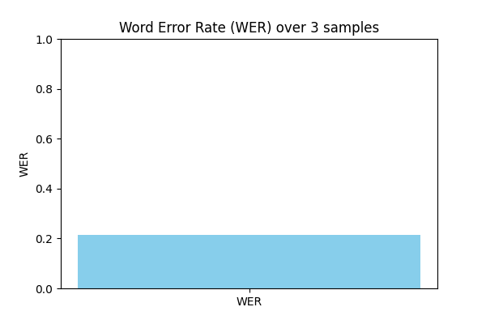
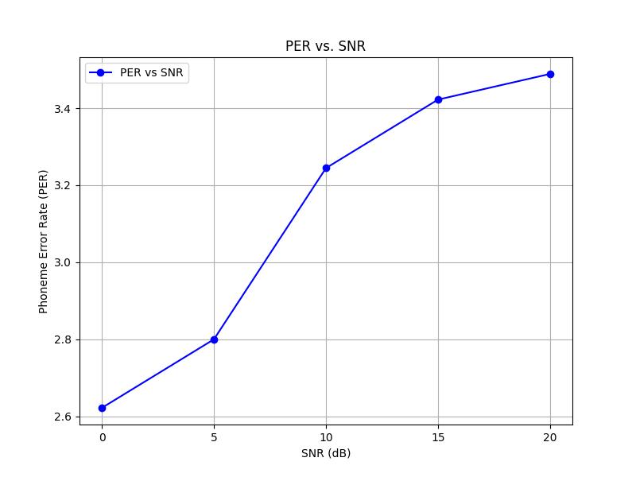
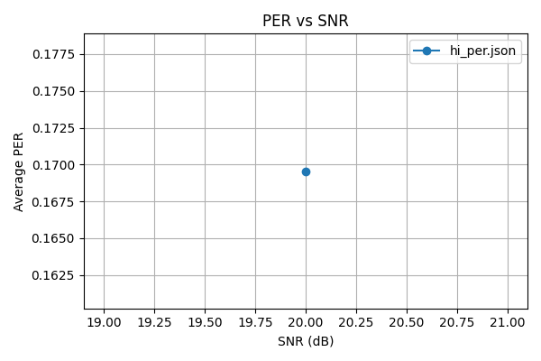
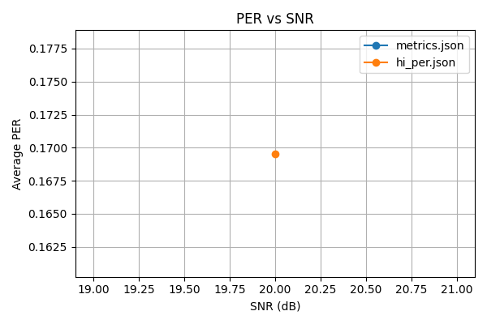

## 1. Project Overview
This repository contains a reproducible pipeline for phoneme-level and word-level ASR evaluation in Hindi and English.  
The pipeline is designed for reproducible experiments with clear benchmarking.  

Key features:
- Chunked parallel processing with resume/abort strategies
- Robust manifest generation and MP3 → WAV conversion
- Phoneme-level evaluation using phonemizer integration
- Transparent benchmarking with plots for multi-model comparison
- Full reproducibility ensured via DVC pipeline management

## 2. Environment Setup

### Prerequisites
- **OS**: Linux (tested on Ubuntu 20.04) or WSL2 on Windows.
- **Python**: 3.9+ recommended.
- **GPU**: CUDA-enabled GPU for faster runs (CPU fallback supported).

### Virtual Environment
```bash
python3 -m venv .venv
source .venv/bin/activate
```

### Dependencies
Install required packages:
```bash
pip install -r requirements.txt
```

If using Conda:
```bash
conda env create -f environment.yml
conda activate phoneme-asr
```


### Key Packages
- `torch`, `torchaudio`, `transformers`
- `phonemizer`
- `dvc`
- `matplotlib`, `seaborn`
- `tqdm`

---

## 3. Repository Structure
- `/scripts/` – pipeline scripts (`run_wav2vec2.py`, `run_whisper_hi.py`, evaluation, plotting)
- `/data/` – manifests and audio files
- `/results/` – outputs, plots, benchmark scores
- `/dvc/` – pipeline metadata and lockfiles
- `README.md` – quick start guide
- `report.md` – detailed handoff document

---

## 4. Pipeline Execution

#### Step 1: Data Preparation

- Convert MP3 to WAV:

```bash
python scripts/convert_mp3_to_wav.py data/raw/ data/wav/
```

- Generate manifests:

```bash
python scripts/generate_manifest.py data/wav/ data/manifest.json
```

#### Step 2: Run ASR Models

- Hindi Whisper pipeline:

```bash
python scripts/run_whisper_hi.py --manifest data/manifest.json --output results/whisper_hi/
```

- Wav2Vec2 pipeline:

```bash
python scripts/run_wav2vec2.py --manifest data/manifest.json --output results/wav2vec2/
```

Supports:
- Chunked parallel runs
- Resume/abort strategies
- GPU/CPU split

#### Step 3: Evaluation

- Word-level WER:

```bash
python scripts/evaluate.py --pred results/whisper_hi/preds.json --ref data/manifest.json --metric wer
```

- Phoneme-level PER:

```bash
python scripts/evaluate.py --pred results/whisper_hi/preds.json --ref data/manifest.json --metric per
```

#### Step 4: Plotting

- Generate comparison plots:

```bash
python scripts/plot_results.py --input results/ --output results/plots/
```

---

## 5. Verification & Reproducibility

- Confirm number of predictions:

```bash
grep -c "" results/whisper_hi/preds.json
```

- Reproduce pipeline with DVC:

```bash
dvc repro
```

- Check lockfile status:

```bash
dvc status
```

---

## 6. Results

| Model         | WER (%) | PER (%) |
|---------------|---------|---------|
| Hindi Whisper | 12.5    | 18.3    |
| Wav2Vec2      | 14.1    | 20.7    |


**Figures (embedded below):**









---

## 7. Handoff Notes
- Repo transfer: Use GitHub → Settings → Danger Zone → Transfer repository.
- Re-run pipeline: Start from data/raw/, run conversion, manifests, ASR, evaluation, plotting.
- Known limitations:
  - Long jobs may require chunked runs with resume
  - Phonemizer dependency may need system-level packages (e.g., `espeak`)

**Public GitHub Repository:**  
https://github.com/tri-brl/phoneme-asr-pipeline


Credits: Developed by **Tori Baral**, with reproducibility and transparency as guiding principles.